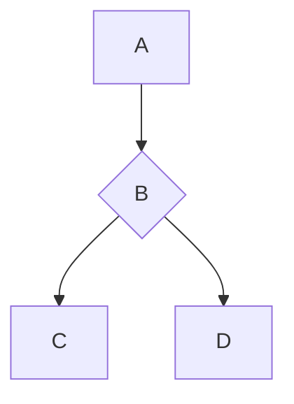
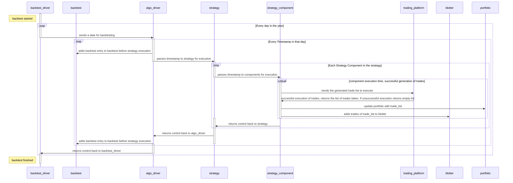
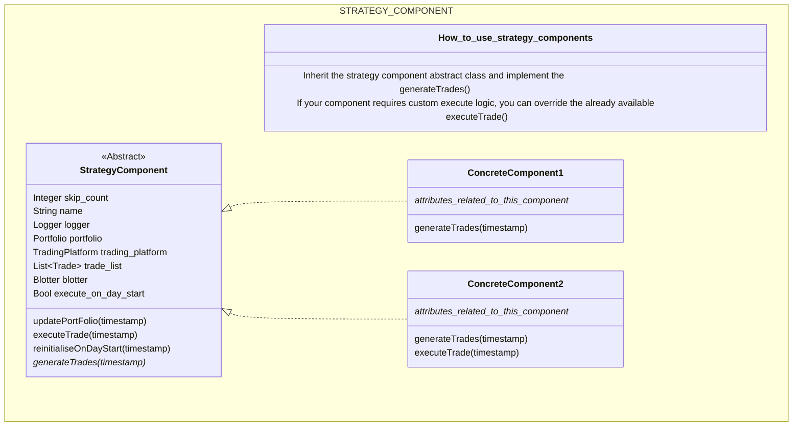
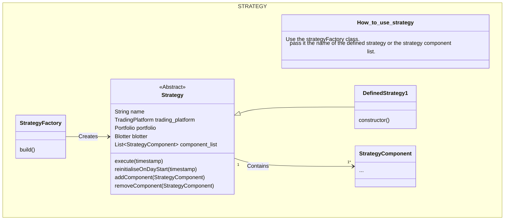

Mermaid samples

---
Flowchart

```mermaid

flowchart
    A --> B{B}
    B --> C
    B --> D


```
---
sequence diagram

```mermaid
sequenceDiagram
    participant backtest_driver
    participant backtest
    participant algo_driver
    participant strategy
    participant strategy_component
    participant trading_platform
    participant blotter
    participant portfolio
    activate backtest_driver
    note left of backtest_driver: backtest started
    loop Every day in the year
        backtest_driver ->> algo_driver: sends a date for backtesting
        deactivate backtest_driver
        activate algo_driver
        loop Every Timestamp in that day
            algo_driver ->> backtest: adds backtest entry to backtest before strategy execution
            algo_driver ->> strategy: passes timestamp to strategy for execution
            deactivate algo_driver
            activate strategy
            loop Each Strategy Component in the strategy
                strategy ->> strategy_component: passes timestamp to components for execution
                deactivate strategy
                activate strategy_component
                critical component execution time, successful generation of trades
                    strategy_component ->> trading_platform: sends the generated trade list to execute
                    trading_platform ->> strategy_component: successful execution of trades, returns the list of trades taken. If unsuccessful execution returns empty list
                    strategy_component ->> portfolio: update portfolio with trade_list
                    strategy_component ->> blotter: adds trades of trade_list to blotter
                end
                deactivate strategy_component
                activate strategy
                strategy_component ->> strategy: returns control back to strategy
            end
            strategy ->> algo_driver: returns control back to algo_driver
            algo_driver ->> backtest: adds backtest entry to backtest before strategy execution
            deactivate strategy
            activate algo_driver
        end
        algo_driver ->> backtest_driver: returns control back to backtest_driver
        deactivate algo_driver
        activate backtest_driver
    end
    note left of backtest_driver: backtest finished
    deactivate backtest_driver
```
---

```mermaid
classDiagram
    namespace STRATEGY_COMPONENT {
        class How_to_use_strategy_components {
            Inherit the strategy component abstract class and implement the generateTrades() 
            If your component requires custom execute logic, you can override the already available executeTrade()
        }
        class StrategyComponent {
            <<Abstract>> 
            Integer skip_count
            String name
            Logger logger
            Portfolio portfolio
            TradingPlatform trading_platform
            List~Trade~ trade_list
            Blotter blotter
            Bool execute_on_day_start

            updatePortFolio(timestamp)
            executeTrade(timestamp)
            reinitialiseOnDayStart(timestamp)
            generateTrades(timestamp)*
        }

        class ConcreteComponent1 {
            attributes_related_to_this_component*
            
            generateTrades(timestamp)
        }

        class ConcreteComponent2 {
            attributes_related_to_this_component*

            generateTrades(timestamp)
            executeTrade(timestamp)
        }
    }
    StrategyComponent <|.. ConcreteComponent1
    StrategyComponent <|.. ConcreteComponent2
```

```mermaid
classDiagram
    namespace STRATEGY {
        class How_to_use_strategy {
            Use the strategyFactory class. 
            pass it the name of the defined strategy or the strategy component list.
        }
        class Strategy {
            <<Abstract>>
            String name
            TradingPlatform trading_platform
            Portfolio portfolio
            Blotter blotter
            List~StrategyComponent~ component_list

            execute(timestamp)
            reinitialiseOnDayStart(timestamp)
            addComponent(StrategyComponent)
            removeComponent(StrategyComponent)
        }
        class DefinedStrategy1 {
            constructor()
        }

        class StrategyComponent {
            ...
        }
        class StrategyFactory {
            build()
        }
    }
    Strategy <|-- DefinedStrategy1
    Strategy "1" --> "1*" StrategyComponent : Contains
    StrategyFactory --> Strategy: Creates
```